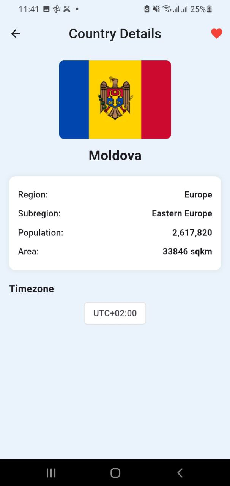

# 🌍 Countries App

A Flutter application that displays a list of independent countries fetched from the [REST Countries API](https://restcountries.com).  
Users can search for countries, view detailed information, and mark countries as favorites (persisted locally using `SharedPreferences`).

---

## 📌 Features

- Fetch list of independent countries from API.
- Search countries by name.
- View detailed country info: name, population, area, region, subregion, and time zones.
- Mark/unmark favorite countries (saved locally).
- Persistent favorites even after app restart.
- Offline-friendly (cached countries list).
- Bottom navigation for switching between Home and Favorites.

---

## 🛠️ Tech Stack

- **Flutter** (UI)
- **Dart** (Logic)
- **BLoC (flutter_bloc)** — State Management
- **Dio** — Networking & API Calls
- **SharedPreferences** — Local Storage for favorites
- **Clean Architecture** — Domain, Data, and Presentation layers

## 🚀 Getting Started

### 1️⃣ Prerequisites

- **Flutter SDK**: Version used → `3.32.0`
- **Dart**: Comes with Flutter SDK
- **Android Studio / VS Code** (with Flutter extension)

### 2️⃣ Setup & Installation

```bash
# Clone the repository
git clone https://github.com/your-username/countries_app.git

# Navigate to project directory
cd countries_app

# Get dependencies
flutter pub get

# Run the app
flutter run
```

## Architecture & State Management

This project follows **Clean Architecture**:

- **Data Layer**: Handles API calls (Dio), local storage (SharedPreferences), and mapping models.
- **Domain Layer**: Defines core business logic with Entities and UseCases.
- **Presentation Layer**: UI with Flutter widgets + state management using **BLoC**.

We chose **BLoC** for:

- Clear separation between UI and logic.
- Reactive, predictable state transitions.
- Testable and maintainable architecture.

### ScreenShots

<table>
  <tr>
    <td align="center">
      <br/>
      <b>Loading Screen</b>
    </td>
    <td align="center">
      <br/>
      <b>Country List</b>
    </td>
  </tr>
  <tr>
    <td align="center">
      <br/>
      <b>Country Detail</b>
    </td>
    <td align="center">
      <br/>
      <b>Favorite Countries</b>
    </td>
  </tr>
  <tr>
    <td align="center">
      <br/>
      <b>Favorite Countries List</b>
    </td>
    <td align="center">
      <br/>
      <b>Search</b>
    </td>
  </tr>
</table>
